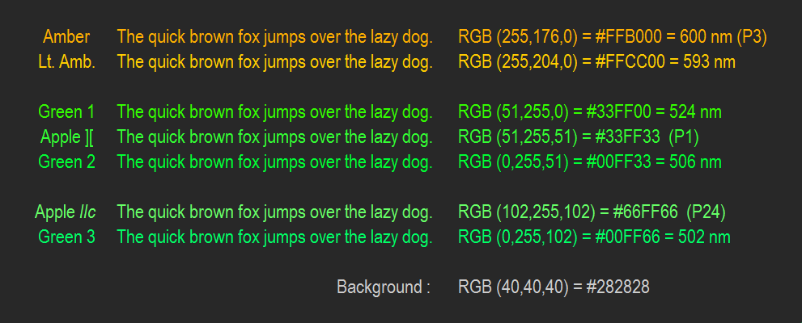

# terminal-monochrome
# monotone-terminal

This is a color scheme based on the idea that syntax highlighting is a sham.

It is heavily inspired by [monotone](https://github.com/Lokaltog/vim-monotone) and my vim port [monotone-terminal](https://gitlab.com/ducktape/monotone-termnial).
The main deviation is that I have chosen to make comments their own color.

The main colors used come from ye odle terminal colors:

Here are a few screenshots in case you are lazy like me:

### For more information
* [Visual Studio Code's Markdown Support](http://code.visualstudio.com/docs/languages/markdown)
* [Markdown Syntax Reference](https://help.github.com/articles/markdown-basics/)

**Enjoy!**
